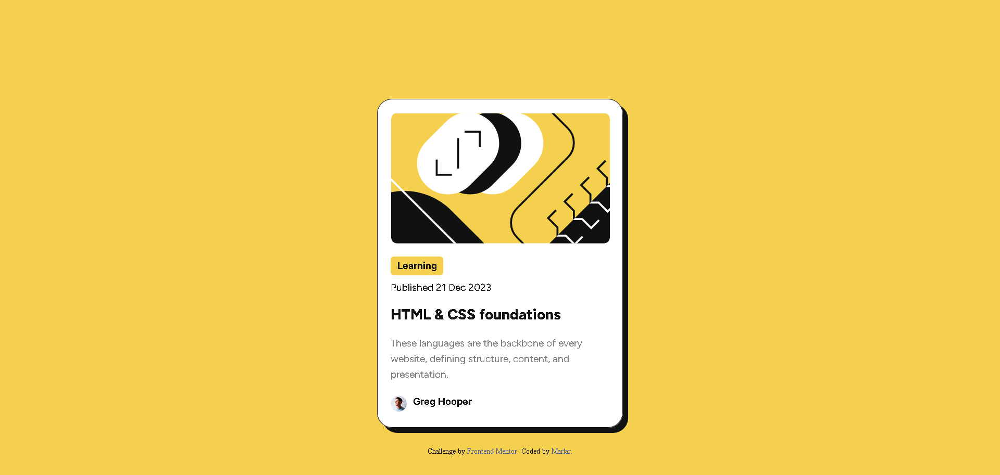
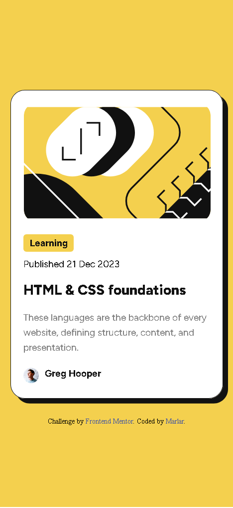
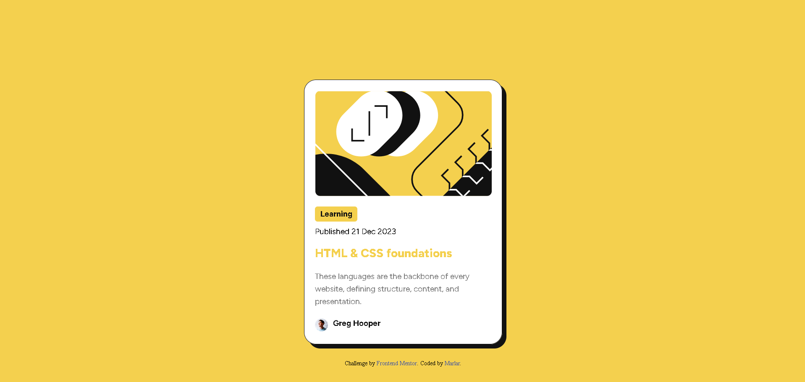

# Frontend Mentor - Blog preview card solution

This is a solution to the [Blog preview card challenge on Frontend Mentor](https://www.frontendmentor.io/challenges/blog-preview-card-ckPaj01IcS). Frontend Mentor challenges help you improve your coding skills by building realistic projects. 

## Table of contents

- [Overview](#overview)
  - [The challenge](#the-challenge)
  - [Screenshot](#screenshot)
  - [Links](#links)
- [My process](#my-process)
  - [Built with](#built-with)
  - [What I learned](#what-i-learned)
  - [Useful resources](#useful-resources)
- [Author](#author)

**Note: Delete this note and update the table of contents based on what sections you keep.**

## Overview

### The challenge

Users should be able to:
- See hover and focus states for all interactive elements on the page

### Screenshot

- Desktop design

- Mobile design 

- Active state preview

### Links

- Solution URL: [solution URL here](https://www.frontendmentor.io/solutions/blog-preview-card-using-html-and-css-GtoEz0Tec1)
- Live Site URL: [live site URL here](https://marlar-tz.github.io/Blog_Preview_Page/)

## My process

### Built with

- HTML5 Responsive
- CSS custom properties

### What I learned

In this challenge , I learned about CSS hover selector , padding, margin and HTML responsive web design.Moreover, I learned about creating card design using CSS properties.

### Useful resources

- [CSS card](https://www.w3schools.com/howto/howto_css_cards.asp) - This taught me about creating card effect using CSS.
- [CSS :hover selector](https://www.w3schools.com/cssref/sel_hover.php) - We can learn more about hover effect in W3schools.

## Author

- Frontend Mentor - [@marlar](https://www.frontendmentor.io/profile/marlar-tz)
