# Previews
| Projects | Demo |
| --- | --- |
| [**3 Column Prview Card Component**](https://github.com/marlar-tz/CSS-Practice-Projects/tree/main/3-column-preview-card-component-main) | 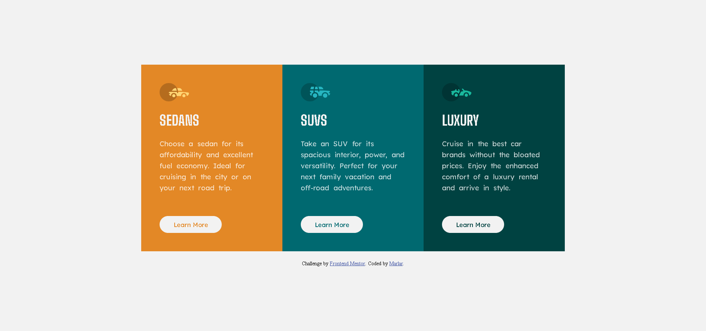 |
| [**Blog Preview Page**](https://github.com/marlar-tz/CSS-Practice-Projects/tree/main/Blog_Preview_Page_Frontend-main) | 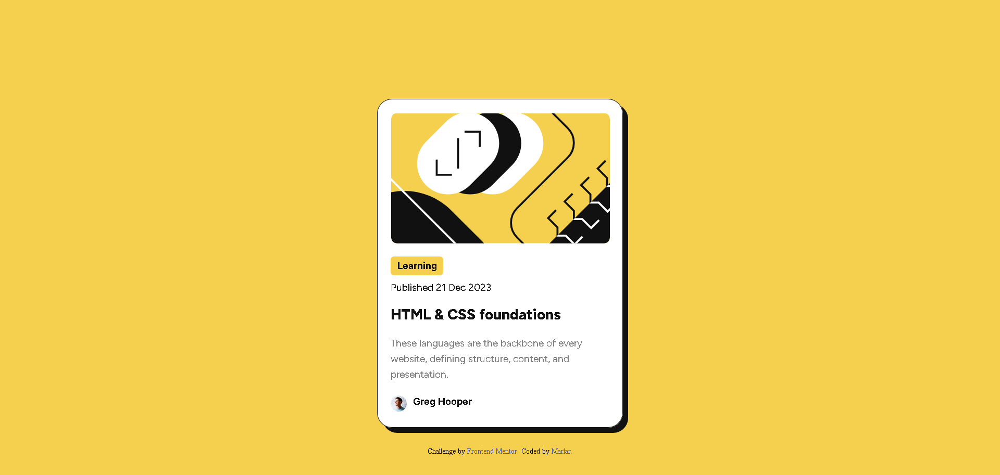 |
| [**Landing Page Simple Animation**](https://github.com/marlar-tz/CSS-Practice-Projects/tree/main/Landing%20page) |  |
| [**QR Code Component Page**](https://github.com/marlar-tz/CSS-Practice-Projects/tree/main/QR_Code_Component_Page_Frontend-main) | 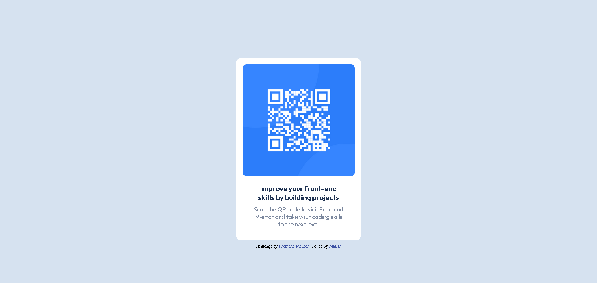 |
| [**Responsive Recipe Page**](https://github.com/marlar-tz/CSS-Practice-Projects/tree/main/Responsive_Recipe_Page_Frontend-main) | 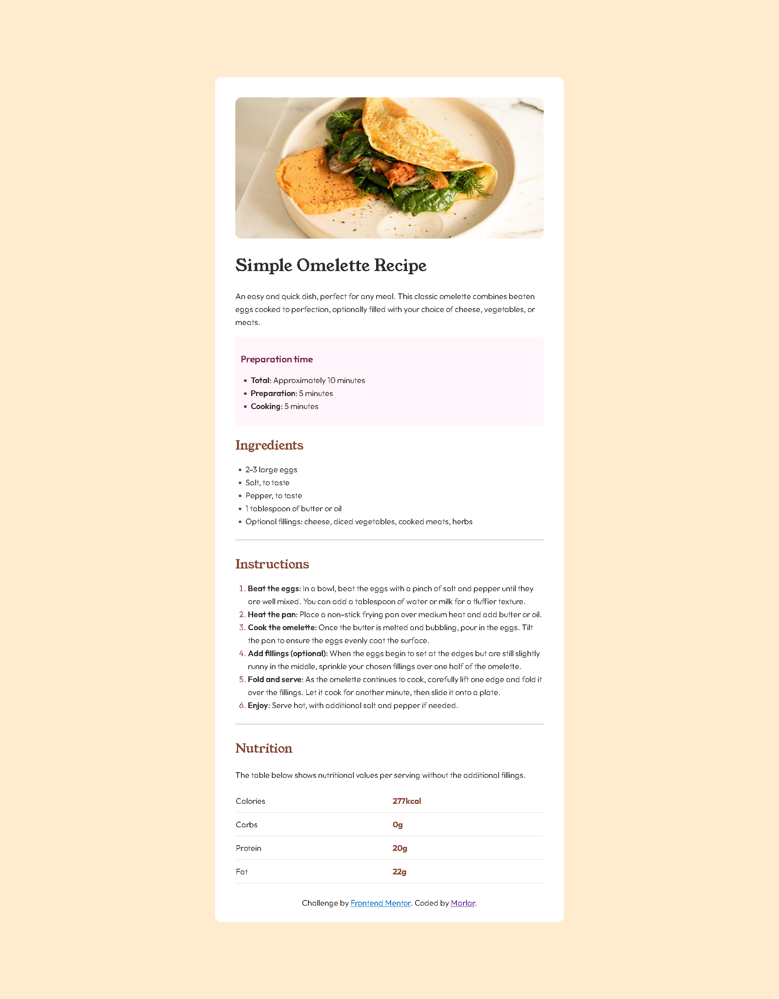 |
| [**Result Summary Component**](https://github.com/marlar-tz/CSS-Practice-Projects/tree/main/Result_Summary_Component-Frontend-main) | 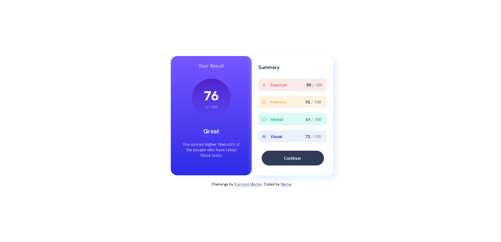 |
| [**Social Link Profile Page**](https://github.com/marlar-tz/CSS-Practice-Projects/tree/main/Social_Link_Profile_Page_Frontend-main) | 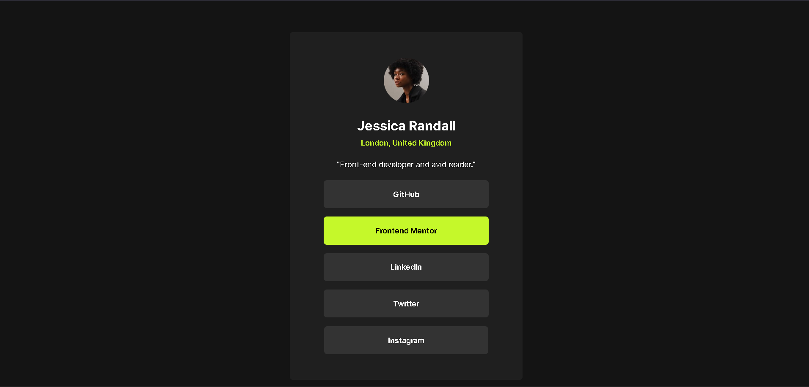 |
| [**Web Blog Frontend**](https://github.com/marlar-tz/CSS-Practice-Projects/tree/main/Web_Blog_Frontend-main) | 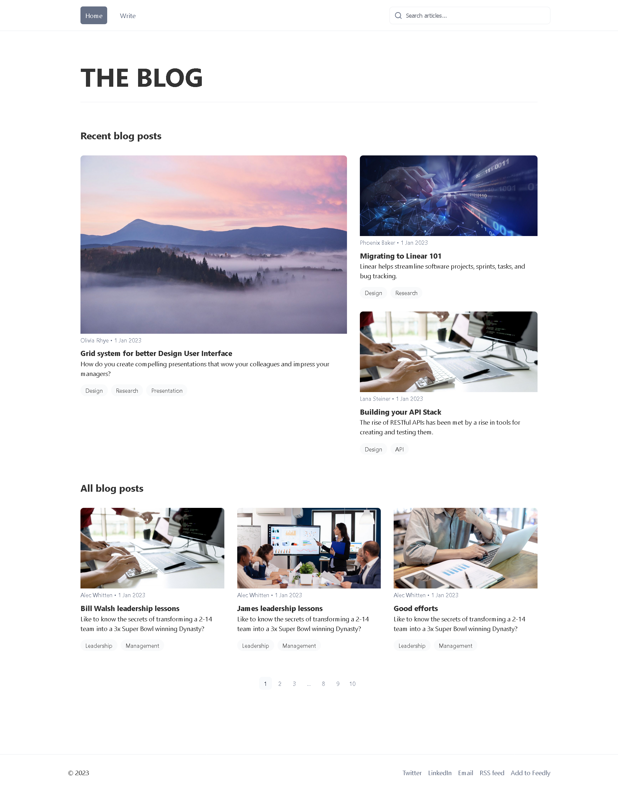 
 
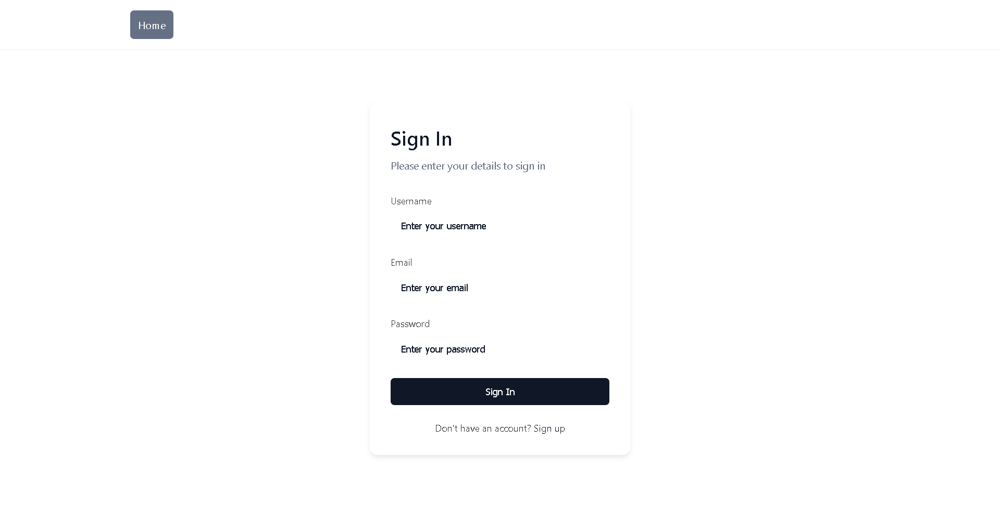 |
| [**FAQ Accordion**](https://github.com/marlar-tz/CSS-Practice-Projects/tree/main/faq-accordion-main) | 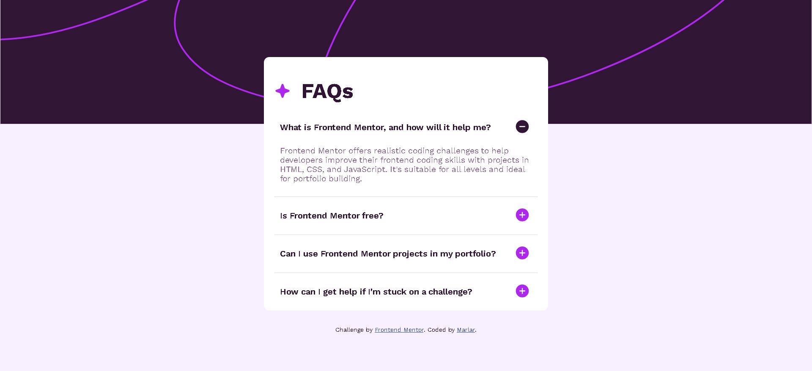 |
| [**Interactive Rating Component**](https://github.com/marlar-tz/CSS-Practice-Projects/tree/main/interactive-rating-component-main) | 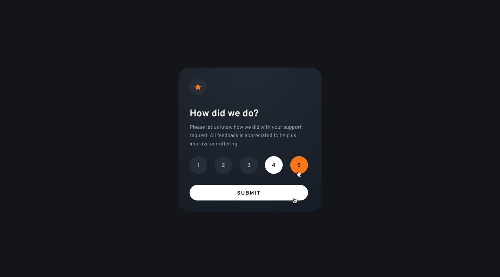
 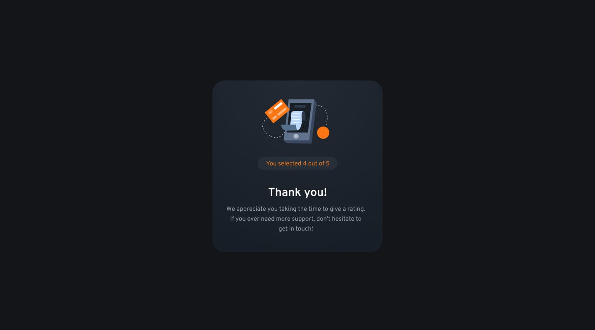  |

